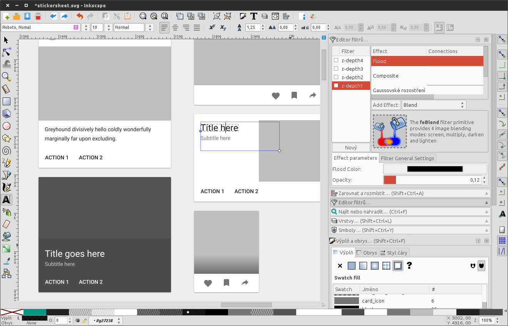
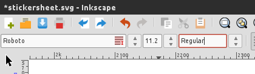
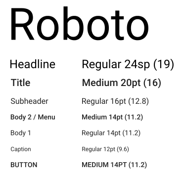
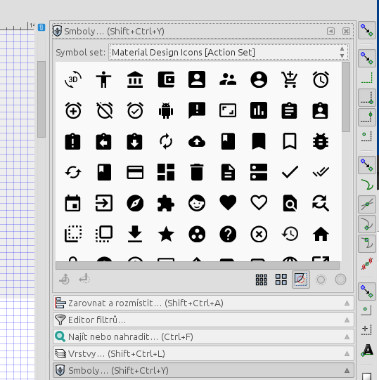
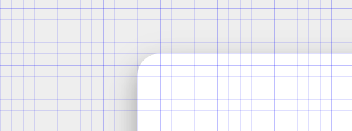
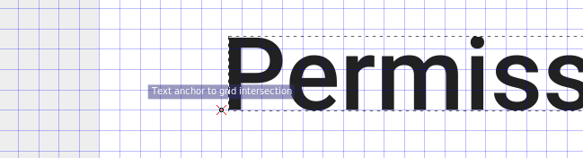

# Material Design Sticker Sheet for Inkscape (SVG)

***Note:** This stickersheet was made for Inkscape v0.91. In Inkscape 0.92 new text measurement was introduced and therefore makes all texts in this file slightly moved. The problem should be fixed in some future Inkscape release. Until then I recommend to use the slightly older 0.91 version.*

Unofficial stickersheet for Inkscape based on the [official Material Design resources](https://www.google.com/design/spec/resources/sticker-sheets-icons.html) and amazing "[Material Design Shadows for Inkscape (SVG)](http://shiningwingpony.deviantart.com/art/Material-Design-Shadows-for-Inkscape-SVG-490418162)" by ShiningWingPony.

The original bitmap that is being vectorized is in the [original.png](original.png) file. You can make it visible in Inkscape by enabling layer "Original".

## Shadows

Thanks to [ShiningWingPony](http://shiningwingpony.deviantart.com/)'s filters you can easily add material shadows:

1. Select your object
2. Open the Filters > Filter Editor menu
3. Click the checkbox on the z-depth you need to use.

Keep in mind that Inkscape only allows blurs to extend up to 10% of the object's size before being cut off. To get around this, group your object with an invisible rectangle as big as the shadow needs to be, then apply the filter to the whole group.

You can see this in use on the Floating Action Button (FAB).

## Colors and swatches

Swatches are not used (anymore) as it caused some issues with copying objects. You can at least use the [enclosed cheatsheet](colors.md) to speed up colors selection.

You can also install Material Colors palette from [ksoichiro](https://github.com/ksoichiro/material-design-colors) or [KiSSFLOW](https://github.com/KiSSFLOW/gimp-material-design-color-palette).

## Fonts

The Roboto font must be installed. Inkscape doesn't show the *Regular* variant of the font, but allows you to **type it directly to the font type dropdown**.

## Material Icons

The most comfortable way of browsing and inserting material icons is to use the new *Symbols* dialog introduced in Inkscape 0.91. You can download the appropriate icon set from [Xaviju/inkscape-open-symbols](https://github.com/Xaviju/inkscape-open-symbols).

## Precision

The whole drawing should be pixel-aligned to prevent blurry edges. You can achieve this by activating pixel grid and snapping. Text boxes are pixel-aligned by its baseline (snapping available from Inkscape 0.91).

To display the same **font size values** as mentioned in Material Design Guidelines you need to set `px` as default font size unit in Inkscape settings.

Inserted **material icons** from [Xaviju/inkscape-open-symbols](https://github.com/Xaviju/inkscape-open-symbols) are scaled down by factor **0.5**.

## License

Files are distributed under the [MIT License](LICENSE).
